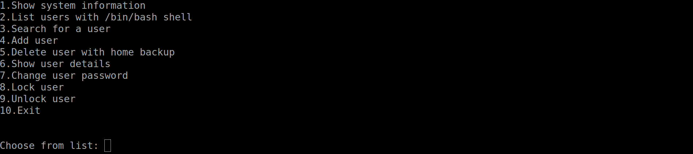

  

# User Management using Bash Script Project

## Table of Contents
  - [Features](#features)
  - [Installation](#installation)
  - [Usage](#usage)
  - [Project's Demo Video](#projects-demo-video)
  - [Contributors](#contributors)
  - [License](#license)

## Features
  -[x] Show System Information
  -[x] List users with /bin/bash shell
  -[x] Search for a user
  -[x] Add user
  -[x] Delete user (with home backup)
  -[x] Show user details
  -[x] Change user password
  -[x] Lock user
  -[x] Unlock user
  -[x] Exit

## Installation
  - Clone the GitHub Repo.
  ```bash
  user@machine:~$ git clone https://github.com/AAEmara/bash-user_management.git
  ```

  - Move to the repo's directory.
  ```bash
  user@machine:~$ cd bash-user_management/
  user@machine:~/bash-user_management/
  ```

  - **Now you can use the project.**

## Usage
  - **Run the `main.sh` to start the bash program.**   
  ```bash
  user@machine:~/$ ./main.sh
  ```

  

  - **Choose a service and enter its number.**   
  For example, `Show user details` is 6:

  

  - **Strike Enter or Return button**. Then insert the input asked by the prompt.

  

## Project's Demo Video
[](https://youtu.be/ysEbl0C9TSw)

## Contributors
  - [@KAboelnaga](https://github.com/KAboelnaga)
  - [@AAEmara](https://github.com/AAEmara)

## License
This project is licensed under the MIT License - see the [LICENSE](LICENSE) file for details.
